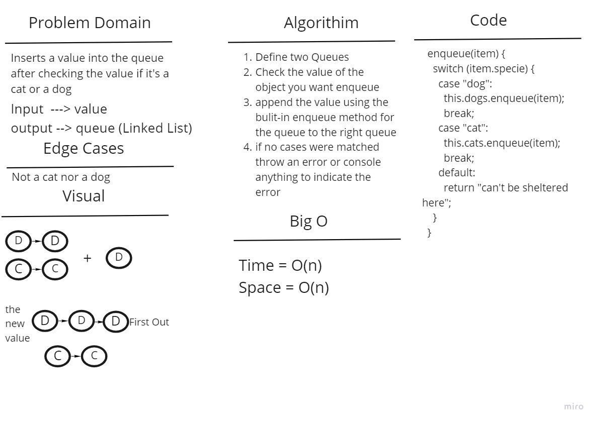
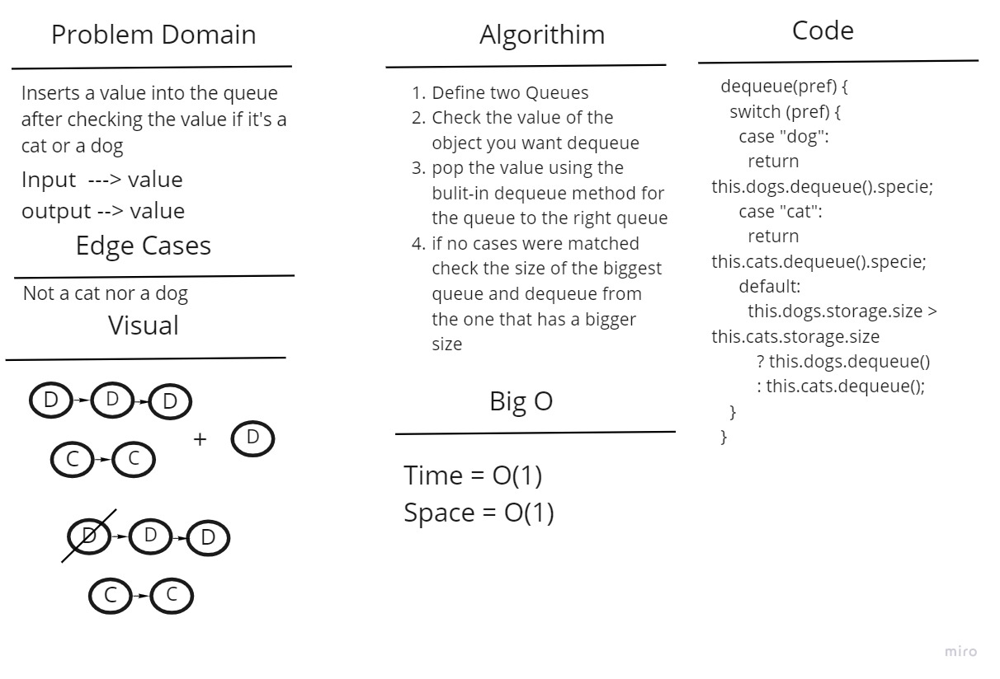

# Challenge Summary

Create a class called AnimalShelter which holds only dogs and cats. The shelter operates using a first-in, first-out approach.

## Whiteboard Process

1. Enqueue method:

2. Dequeue method:

## Approach & Efficiency

- Enqueue method: As the queue is already a linked List and linked list already have an append method we're going to use it. so in this case we are using a O(n) time complexity.

- Dequeue method: It has the space and time complexity of O(1).

## Solution

- Enqueue: As the linked List already have an append method we're going to use it but we defined two queues so we'll have to check the input using a switch statement to append to the right queue.

- Dequeue method: We'll change the head value to null and move the pointer of the linked list to the next value after checking the input using a switch statement.
