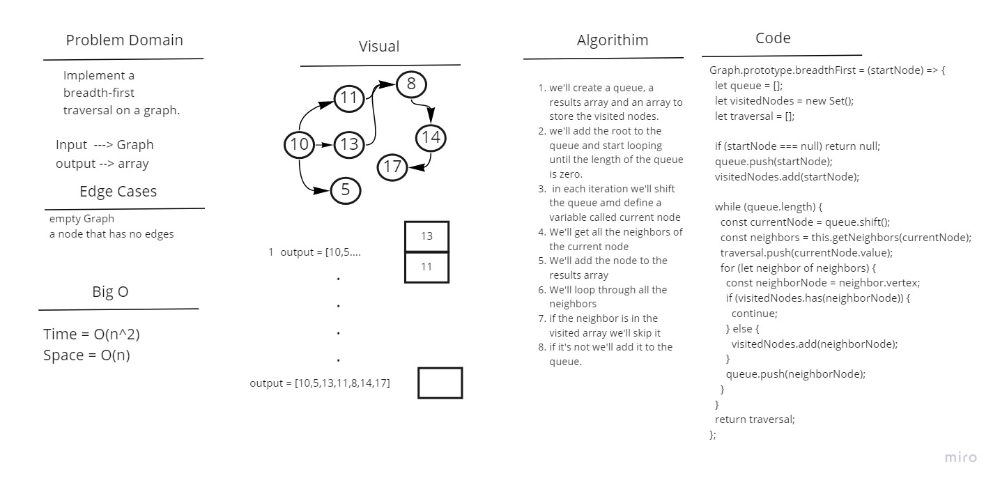

# Graph Breadth First Traversal

Implement a breadth-first traversal on a graph.

## Whiteboard Process

## Approach & Efficiency

Breadth First: The time complexity is O(n^2) as we'll have to loop through the queue while also looping through all the vertex edges, the space complexity is O(n) as we'll be creating a queue to store the vertices in.

## Solution

Insertion Sort: We'll loop through the given array starting from the second element, in each iteration we'll also loop through the array again this time but each time we'll start from the current i till we reach zero or the current j index is bigger that the current i. Then we'll update the temp value to be the next j index we're currently at.
