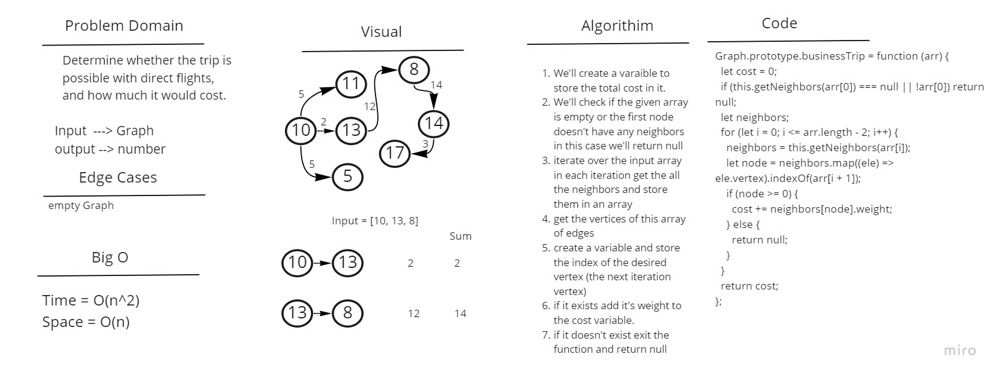

# Graph Business Trip

Determine whether the trip is possible with direct flights, and how much it would cost.

## Whiteboard Process

## Approach & Efficiency

Business Trip: The time complexity is O(n^2) as we'll have to loop through the input array while also looping through all the vertex edges, the space complexity is O(n) as we'll be creating an array to store the edges in.
