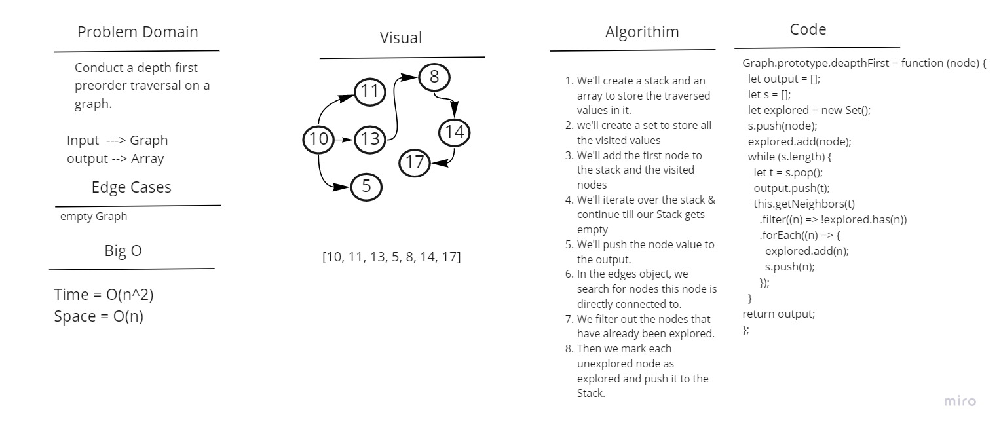

# Graph Breadth First Traversal

Conduct a depth first preorder traversal on a graph.

## Whiteboard Process

## Approach & Efficiency

Breadth First: The time complexity is O(n^2) as we'll have to loop through the queue while also looping through all the vertex edges, the space complexity is O(n) as we'll be creating a queue to store the vertices in and an array to store the traversed values.
