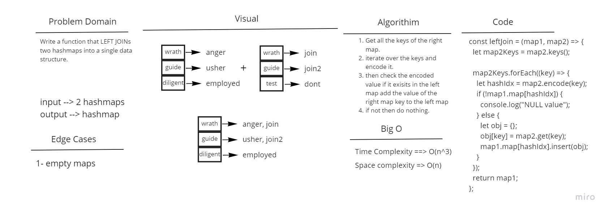

# Challenge Summary

Write a function that LEFT JOINs two hashmaps into a single data structure.

## Whiteboard Process

## Approach & Efficiency

Time complexity will be O(n^3) as we'll be using the keys method and space complexity will be O(n).

## Solution

Call the function leftJoin and pass two hashmaps to it.
