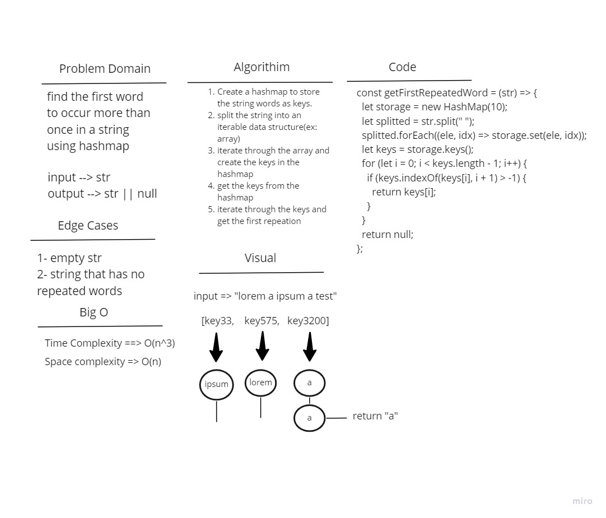

# Challenge Summary

Write a function called repeated word that finds the first word to occur more than once in a string

## Whiteboard Process

## Approach & Efficiency

Time complexity will be O(n^3) and space complexity will be O(n).

## Solution

Call the function getFirstRepeatedWord and pass a string to it.
