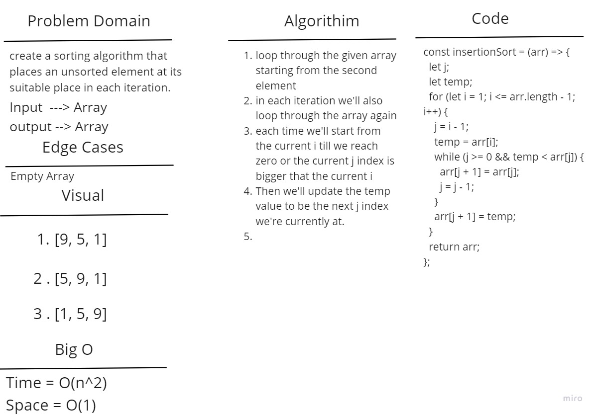

# Insertion Sort

create a sorting algorithm that places an unsorted element at its suitable place in each iteration.

## Whiteboard Process

## Approach & Efficiency

Insertion Sort: The time complexity is O(n^2) as we'll have to use a nested loop to sort the array, We are not adding anything new to the memory therefore the space complexity will be O(1).

## Solution

Insertion Sort: We'll loop through the given array starting from the second element, in each iteration we'll also loop through the array again this time but each time we'll start from the current i till we reach zero or the current j index is bigger that the current i. Then we'll update the temp value to be the next j index we're currently at.
