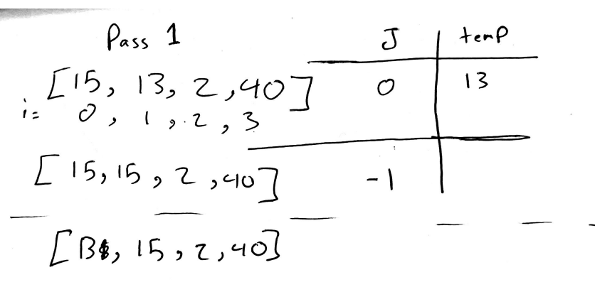
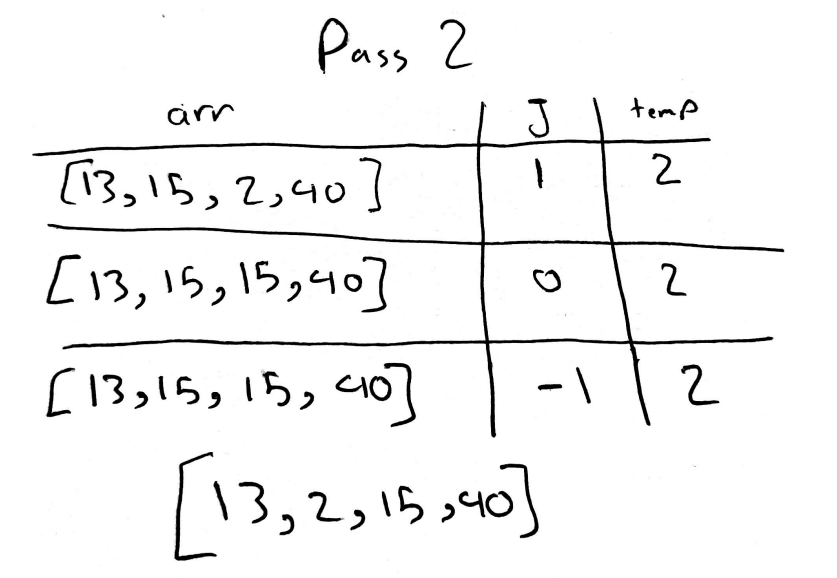

# Insertion Sort

Insertion sort is the sorting mechanism where the sorted array is built having one item at a time. The array elements are compared with each other sequentially and then arranged simultaneously in some particular order.

## Pseudocode

```
  InsertionSort(int[] arr)

    FOR i = 1 to arr.length

      int j <-- i - 1
      int temp <-- arr[i]

      WHILE j >= 0 AND temp < arr[j]
        arr[j + 1] <-- arr[j]
        j <-- j - 1

      arr[j + 1] <-- temp

```

## Trace

Sample Array: `[15,13,2,40]`

Pass 01:



Pass 02:



All the other iterations will follow the same logic illustrated in the above photos. After i reaches the array length you'll have been through all of the array and sorted it.

## Efficency

- Time: O(n^2)
  The basic operation of this algorithm is comparison. This will happen n \* (n-1) number of times…concluding the algorithm to be n squared.
- Space: O(1)
  No additional space is being created. This array is being sorted in place…keeping the space at constant O(1).
