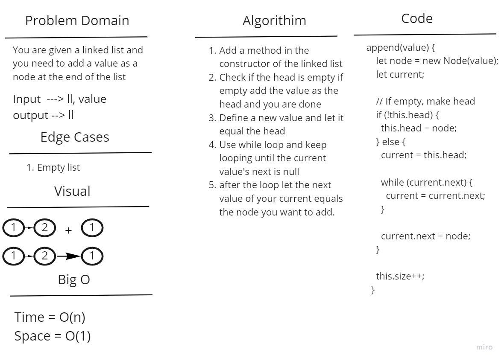
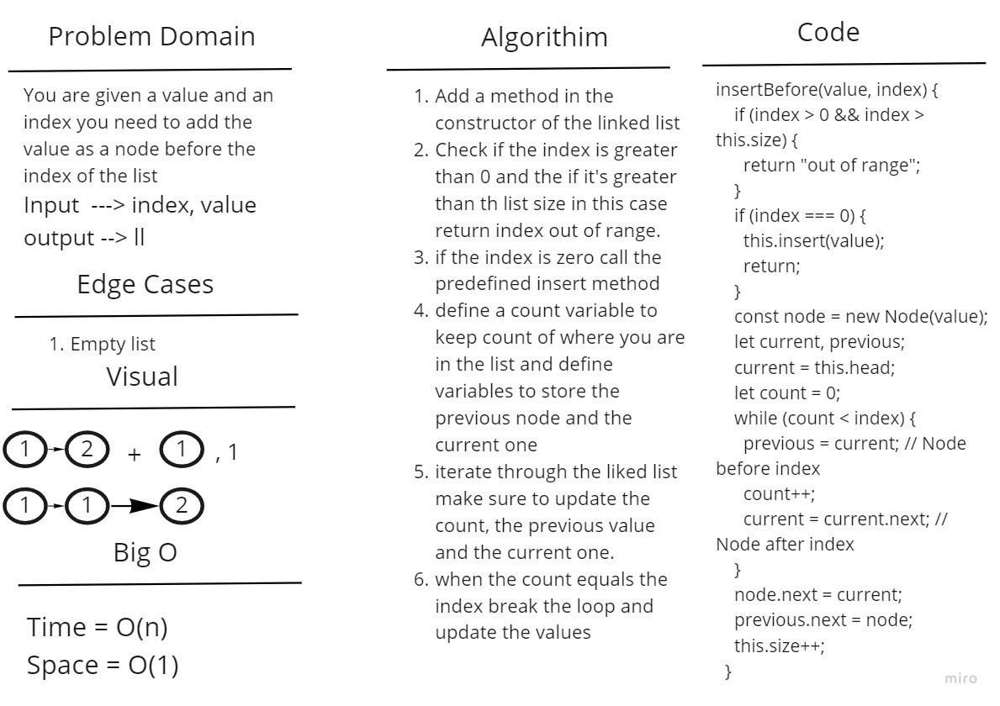

# Singly Linked List

## Challenge

1. Insert a node at the end.
2. adds a new node with the given new value immediately before the first node that has the value specified
3. adds a new node with the given new value immediately after the first node that has the value specified

## Approach & Efficiency

- append method: time and space complexity are O(n) as you don't know what is the length of the list so you'll have to loop over it.

- insert before method: The time complexity is O(n) as we'll have to loop through the list to reach the given index, this will also mean that the space complexity is O(n).

- insert after method: The time complexity is O(n) as we'll have to loop through the list to reach the given index, this will also mean that the space complexity is O(n).

## Solution

- append method: you'll have to loop through the linked list and when the next value equals null you have reached the end append there.

- insert before method: we'll have to loop through the list to reach the given index, when you reach the given index let the previous node point to the new node and the new node point to next one.

- insert after method: just as the insert before but increase the value of the index by one.

## Whiteboard Process

1. 
2. 
3. For insert after just increase the value of the index inputed by the user by one and use the same insert before algorithim
