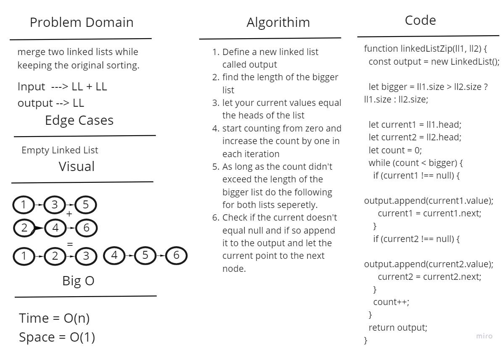

# Singly Linked List

## Challenge

Implement an algorithim that zips two linked lists together into one so that the nodes alternate between the two lists and return a reference to the the zipped list.

## Approach & Efficiency

The time complexity is O(n) as we'll have to loop through the lists and append thier nodes to the output, The space complexity is O(1).

## Solution

We'll find the length of the bigger list, then we'll let the current values equal the heads of the list and start counting from zero and increase the count by one in each iteration. As long as the count didn't exceed the length of the bigger list do the following for both lists seperetly:
Check if the current doesn't equal null and if so append it to the output and let the current point to the next node.

## Whiteboard Process

