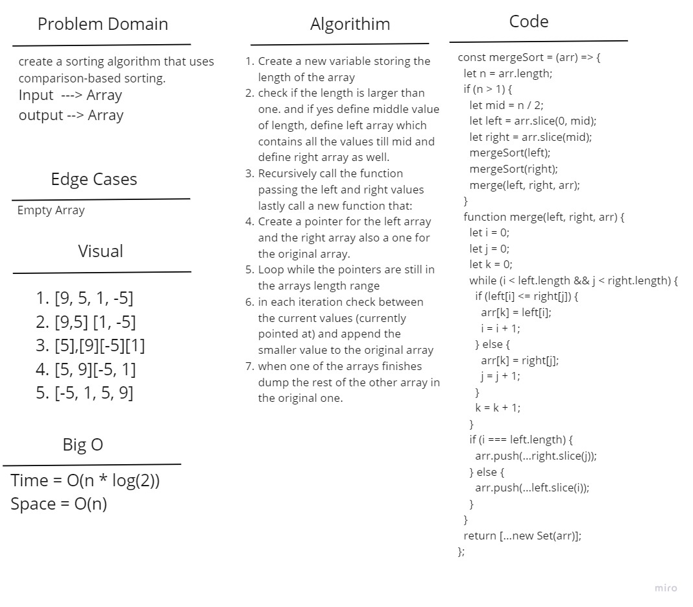

# Insertion Sort

create a sorting algorithm that uses comparison-based sorting.

## Whiteboard Process

## Approach & Efficiency

Insertion Sort: The time complexity is O(n \* log(n)) as we'll have to use a recursive approach to split the array and a loop to keep track of the pointer, We'll be creating a new arrays so the space complexity will be O(n) .

## Solution

Insertion Sort: We'll split the array into the smallest blocks possiable, and we'll start sorting them as a blocks eachtime.
