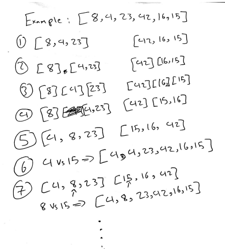

# Merge Sort

Merge sort is an efficient, general-purpose, and comparison-based sorting algorithm. Most implementations produce a stable sort, which means that the order of equal elements is the same in the input and output.

## Pseudocode

```
ALGORITHM Mergesort(arr)
    DECLARE n <-- arr.length

    if n > 1
      DECLARE mid <-- n/2
      DECLARE left <-- arr[0...mid]
      DECLARE right <-- arr[mid...n]
      // sort the left side
      Mergesort(left)
      // sort the right side
      Mergesort(right)
      // merge the sorted left and right sides together
      Merge(left, right, arr)

ALGORITHM Merge(left, right, arr)
    DECLARE i <-- 0
    DECLARE j <-- 0
    DECLARE k <-- 0

    while i < left.length && j < right.length
        if left[i] <= right[j]
            arr[k] <-- left[i]
            i <-- i + 1
        else
            arr[k] <-- right[j]
            j <-- j + 1

        k <-- k + 1

    if i = left.length
       set remaining entries in arr to remaining values in right
    else
       set remaining entries in arr to remaining values in left

```

## Trace

Sample Array: `[8,4,23,42,16,15]`



All the other iterations will follow the same logic illustrated in the above photos. After i reaches the array length you'll have been through all of the array and sorted it.

## Efficency

- Time: O(n^2)
  The basic operation of this algorithm is recursion and looping the pointer. This will happen n \* log(n) number of times…concluding the algorithm to be n \* log(n) squared.
- Space: O(n)
  Additional space is being created in each recusrion. We'll be creating new arrays so the space complexity will be O(n).
