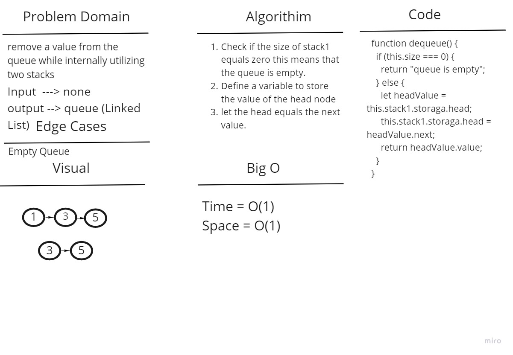

# Challenge Summary

Create a new queue that internally utilizes two Stacks.

## Whiteboard Process

- Enqueue Method:

- Dequeue Method:

## Approach & Efficiency

- Enqueue Method: Time complexity will be O(n) and space complexity will be O(n) as well.
- Dequeue Method: Time complexity will be O(1) and space complexity will be O(1) as well.

## Solution

enQueue(x):

1. While stack1 is not empty, push everything from stack1 to stack2.
2. Push x to stack1.
3. Push everything back to stack1.

deQueue():

1. If stack1 is empty then error.
2. Pop the head of stack1 and return it
