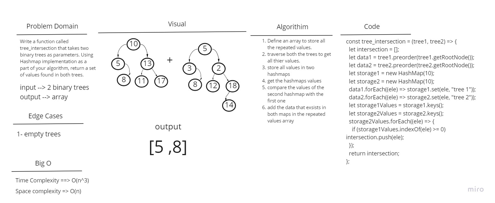

# Challenge Summary

Write a function called tree_intersection that takes two binary trees as parameters. Using Hashmap implementation as a part of your algorithm, return a set of values found in both trees.

## Whiteboard Process

## Approach & Efficiency

Time complexity will be O(n^3) and space complexity will be O(n).

## Solution

Call the function tree_intersection and pass two binary trees to it.
