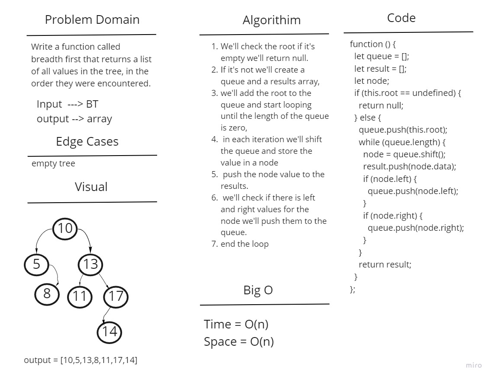

# Challenge Summary

Write a function called breadth first that returns a list of all values in the tree, in the order they were encountered.

## Whiteboard Process

## Approach & Efficiency

The time complexity will be O(n) as we'll be iterating through the tree. While we are iterating we'll be push to an array thus the space complexity is O(n)

## Solution

We'll check the root if it's empty we'll return null. If it's not we'll create a queue and a results array, we'll add the root to the queue and start looping until the length of the queue is zero, in each iteration we'll shift the queue and store the value in a node and push the node value to the results. now we'll check if there is left and right values for the node we'll push them to the queue.
