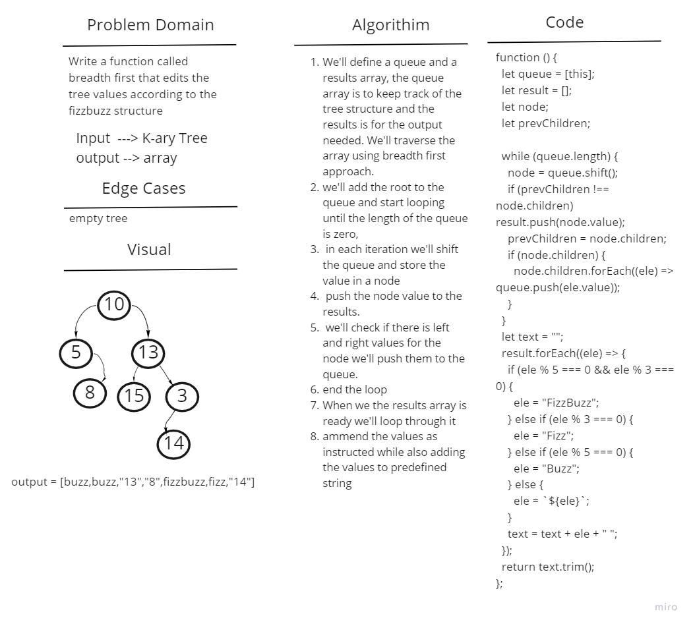

# Challenge Summary

Edit the tree values according to the fizzbuzz structure

## Whiteboard Process



## Approach & Efficiency

Time complexity will be O(n^2) as we'll iterate through the original tree and in each iteration we'll also loop through the node children. The Space complexity will also be O(n^2) as in both loops we are pushing values to the array

## Solution

We'll define a queue and a results array, the queue array is to keep track of the tree structure and the results is for the output needed. We'll traverse the array using breadth first approach.

```
we'll add the root to the queue and start looping until the length of the queue is zero, in each iteration we'll shift the queue and store the value in a node and push the node value to the results. now we'll check if there is children values for the node and if so we'll push them to the queue.

```

When we the results array is ready we'll loop through it and ammend the values as instructed while also adding the values to predefined string.
