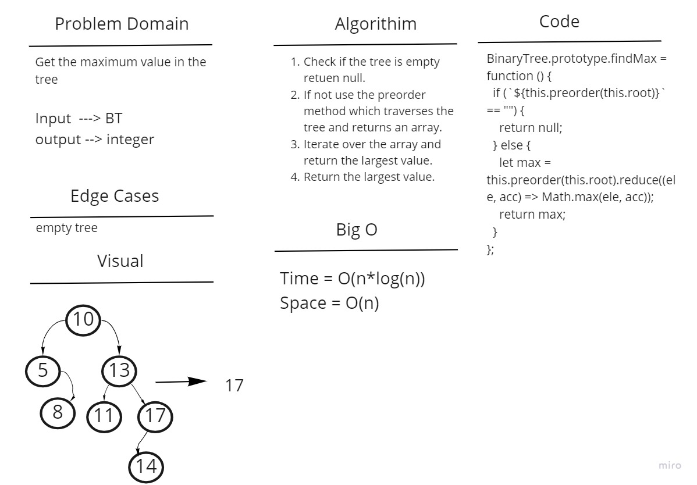

# Challenge Summary

Get the maximum value in the tree

## Whiteboard Process

## Approach & Efficiency

The space complexity O(n) as we'll be adding new elements to the array in the loop, while the time complexity is O(n) because we'll be iterating recursively throgh the whole tree to create the array and we'll loop through the array again to find the maximum value this will lead to O(2n) and the 2 can be dropped

## Solution

The approach was to use one of the predefined tree traversing methods as they already return all the values as an array. We loop through the array to return the largest value
