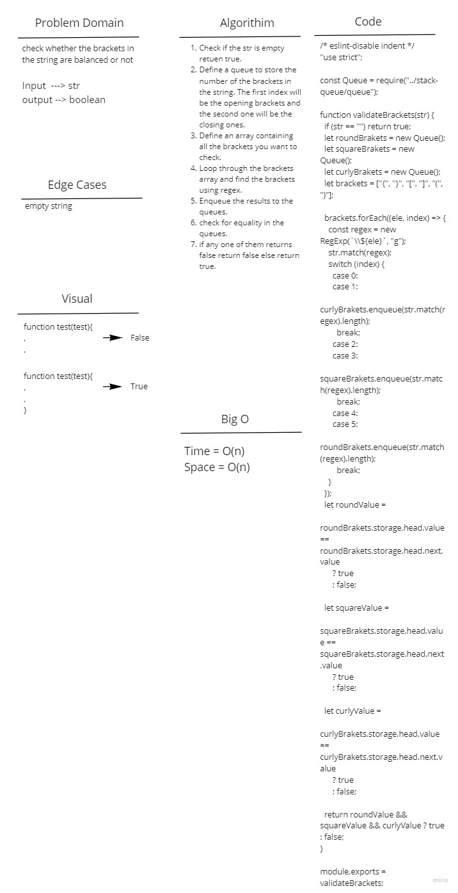

# Challenge Summary

check whether the brackets in the string are balanced or not

## Whiteboard Process

## Approach & Efficiency

Time complexity will be O(n) and space complexity will be O(n) as well.

## Solution

Call the method validateBracket and pass a string to it.
